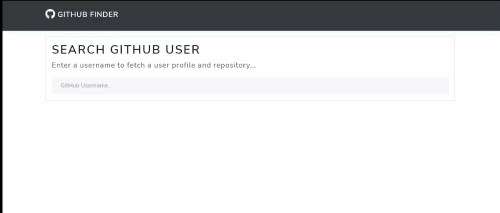

# Github-Finder App

## Welcome! 👋
## Table of contents

- [Github-Finder App](#github-finder-app)
  - [Welcome! 👋](#welcome-)
  - [Table of contents](#table-of-contents)
  - [Overview](#overview)
    - [The challenge](#the-challenge)
    - [Links](#links)
    - [Demo](#demo)
    - [Built with](#built-with)
    - [What I learned](#what-i-learned)
    - [Note](#note)
  - [Author](#author)

## Overview

### The challenge

Users should be able to:

- View the optimal layout for the site depending on their device's screen size
- User can search for any github user 
- User can see plenty of informations associated  with matched profile
- User can view the github user account 
  
### Links
- Live Site URL: [https://flyo-landing-page-main.netlify.app]()

### Demo

### Built with

- Semantic HTML5 markup
- Bootstrap lux theme
- Asynchronous and Object Oriented JavaScript ES6+
  
### What I learned

- Fetch external data API using the **async** and **await**
- Use the **Object Oriented paradigm** in real project

### Note
- To use this application all you need is to regitser in this link : https://github.com/settings/developers then create new OAuth App to get your own client id and secet key (it's simple...)
## Author

- Github [@mounir-m4](https://github.com/mounir-m4)
- Twitter - [@mounirmotawakil](https://twitter.com/mounirmotawakil)
- Frontend Mentor - [@mounir-m4](https://www.frontendmentor.io/profile/mounir-m4)

**happy coding!** 🚀